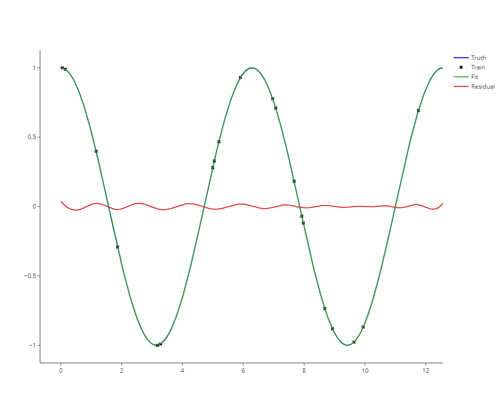

# PINNs
Physics-Informed Neural Networks

This repository contains recreations of the work performed by Raissi et al. (2019). Certain code snippets from said work are imported directly, or used as starting points for the code here.

## Harmonic Oscillator
The first file is a short proof-of-principle on the simplest physical example: the harmonic oscillator. The governing equation for this system is 

The exact solution used for training is

Which is sampled at a number (N ~ 20) of random locations. The loss function penalizes the deviation of the neural network output form these "observations". Additionally, the loss function contains a regularization term that seeks to enforce the governing equations at a denser grid (N ~ 50). Crucially, the governing equations can be evaluated by using automatic differentiation via Tensorflow's GradientTape() to obtain the required derivative(s) from the neural network. The weights & biases of the neural network are trained using Keras's Adam optimizer.

## Korteweg-de Vries Equation
The governing equation is 

The exact solution used for training is 

Again, the loss function fits the neural network to N ~ 150 observations (split between an initial condition and randomly sampled throughout the bulk), and satisfying the governing equations is used as a constraint.

References:

Raissi, Maziar, Paris Perdikaris, and George E. Karniadakis. "Physics-informed neural networks: A deep learning framework for solving forward and inverse problems involving nonlinear partial differential equations." Journal of Computational Physics 378 (2019): 686-707.

Equations generated using https://www.codecogs.com/latex/eqneditor.php
